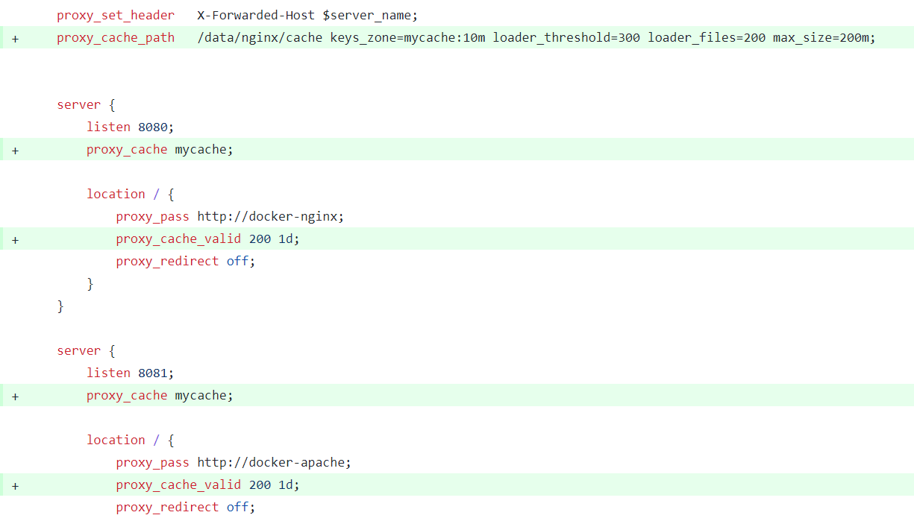

# Nginx Proxy Docker Compose

## Build Docker Image from Dockerfile in Docker Compose

### 1. Create a *reverse proxy*.

```docker
FROM nginx:alpine
 
COPY nginx.conf /etc/nginx/nginx.conf
RUN apk update && apk add bash
```

### 2. Create Docker Compose to run 3 docker container of Nginx

Refer to [docker-compose.yml](./docker-compose.yml).

## Mount Nginx Config of proxy for easy updating

In the path [`./reverse-proxy/nginx.conf`](./reverse-proxy/nginx.conf) we define proxy directive help
passed to original server. But in the development process, we need change on a regular basis. Mount it
to local directory will a good solution for easy for using.

[Diff in Github](https://github.com/nguyenvantien2009/nginx-reverse-proxy/commit/88b3107a6d3f2f0dfbb1c040b2939f1762d25435)

```diff
     ports:
       - 8080:8080
       - 8081:8081
+    volumes:
+      - ./reverse-proxy/nginx.conf:/etc/nginx/nginx.conf
     # restart: always
```

## Nginx Proxy Caching

For any reason, we need cache between original server to reverse proxy. Nginx support config cache with
expire time, limit size of cache...

[](https://github.com/nguyenvantien2009/nginx-reverse-proxy/commit/e6098f3c493c1637ada795795db396bfa4a5d85d?diff=unified)

## References

1. Docker Compose Nginx Reverse Proxy Multiple Containers <https://www.bogotobogo.com/DevOps/Docker/Docker-Compose-Nginx-Reverse-Proxy-Multiple-Containers.php>
2. Introduction to Docker Compose - <https://www.baeldung.com/ops/docker-compose>
